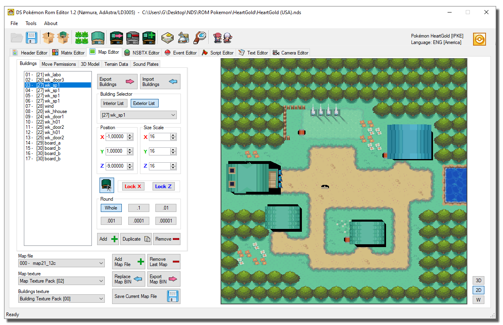
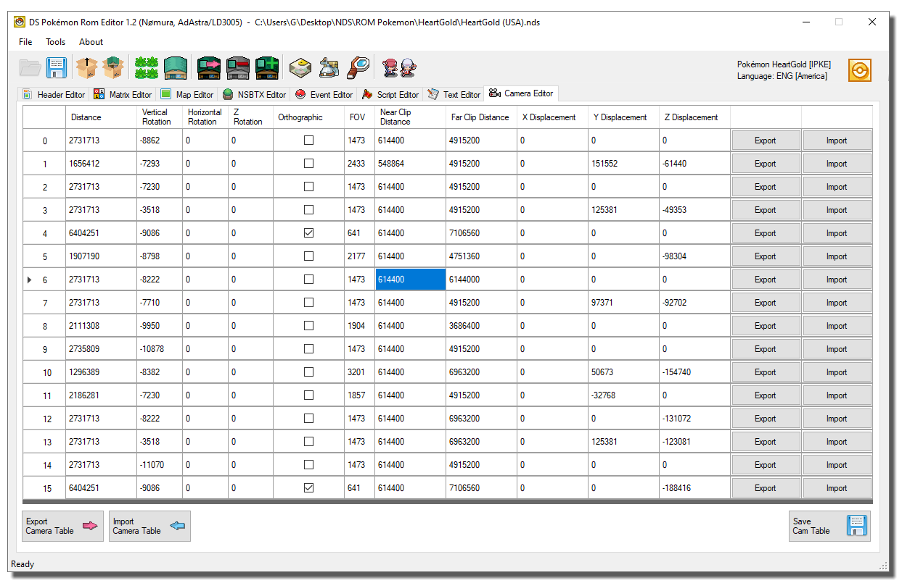
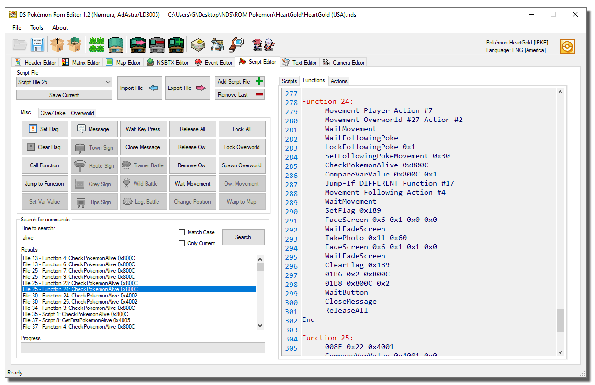

# DS Pokemon Rom Editor

Nomura's C# and WinForm DS Pokemon ROM Editor forked with lots of new features and bugfixes.

## Misc changes to the official DSPRE
- Significantly shorter load and save times.
- Fixed script editor (it's also much faster now).
- Fixed lots of problems with Japanese DP roms [either not loading or only partially functioning].

- Added Advanced Header Search feature.
- New NSBMD and NSBTX utilities.
- Fixed Overworld sprite search algorithm for most (if not all) supported ROMs.
- Lots of new buttons and icons.
- Fixed app name.
- Fixed many Exceptions, which now show user-friendly messages.
- Some fields will now show a colored text depending on their value.
- New ROM Toolbox.
- Added new ALT key shortcuts (Hold alt to see which shortcuts are available).
- Fixed Encounter Editor unpacking HG encounters for SS ROMs.

### ROM Toolbox:
Supported patches:
- Expand ARM9 usable memory.
- BDHCAM.
- Set Overlay1 as uncompressed.
- Standardize item numbers (fixed).
- Pokémon names to Sentence Case.
- Expand matrix 0.

### Script Command Database:
A handy window that shows all the available script commands and the parameters they require.
- Many commands have been identified and added.

### Spawn Settings Editor:
Allows you to change the first map where the adventure begins and the initial money.

### Wild Encounters Editor:
- Added wrench button to fix broken encounter files [whenever possible].
- Added missing button functions (add and remove).
- Wild Encounter Editor can now attempt to repair corrupted encounter files.
- Editor now detects the selected header.

### Header Editor:
- Added copy and paste buttons to every header category editor.
- Added import and export buttons to header editor.
- New basic search location feature.
- Updated Header Fields for all games (added WorldMap Coordinates to HGSS header editor).
- Added more HGSS weather effects.
- Redone HGSS weather preview pics.
- Fixed HGSS Camera settings. 
- Fixed header flag names.
- Editable Internal names.
- Added text length label to Internal Names box (Header Editor).
- Fixed a bug that prevented Internal Names from displaying correctly (String termination).
- Fixed "Open Matrix" button not loading the correct textures and buildings, especially for interior maps.

### Matrix Editor:
- Added support for custom color tables.
- Fixed "add matrix" and "remove matrix" buttons GUI numbering mismatch.
- Fixed wrong row/col indices when resizing matrices.
- Fixed junk input detector.
- The coordinates of the selected map appear in the status bar.

### Map Editor:
- Partial GUI redesign (now with fewer building controls and a more straightforward GUI).
- New BGS Section.
- Expanded collisions database.
- Buildings can now be placed and moved with the mouse.
- Fixed buildings wrong scale transform pivot.
- Map models can be exported with embedded textures.
- Sound Plates can be cleared with a button click.
- Added flood fill feature to Permissions tab.
- Added Section size labels to 3D Model, Terrain and BGS Tabs (Map Editor).
- Added support for broken BTX detection to Map Editor and NSBTX Editor.
- Fixed map screen randomly becoming 3D, even with the collision tab open.
- Added BDHCAM Support to the import/export menu.
- Added Map BIN Import button.
- Fixed BGS signature of maps being overwritten upon saving a map.
- Added Export MAP BIN button.
- Fixed type painters resetting after changing map.
- Fixed type painters font size and value [updown] limit.
- Added more type painter colors and collisions.

### NSBTX Editor:
- GUI Redesign.
- Added missing button functions (add and remove).
- Created a palette match algorithm.

### Event Editor:
- Added mouse support and warps navigation feature.
- Events can now be duplicated.
- New fields (for Spawnables and Triggers).
- Complete rewrite of the Sprite finder.

### Script Editor:
- Replaced "Search Flag" with "Search any command".
- Enabled some of the quick script cmd buttons.
- Level scripts can be cleared with a button click.
- The Script Editor can identify and report some errors.
- Fixed problem with backward jumps.
- Fixed Text Search and Replace (Results can be double-clicked).
- Improved search speed.
- Fixed script export button.

### Text Editor:
- Added New Movement names and changed some of the old ones.
- Fixed export button.
- Added option to show row numbers as hex.
- Fixed Text Search and Replace (Results can be double-clicked).
- Improved search speed.
- Added support for Chinese text.

### Camera Editor:
You can easily change the default camera position in game.