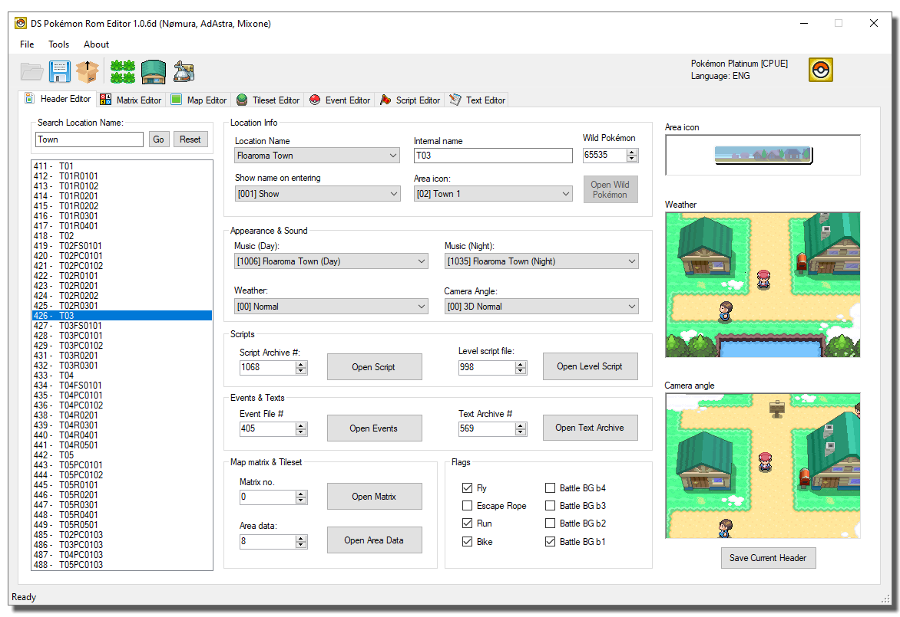
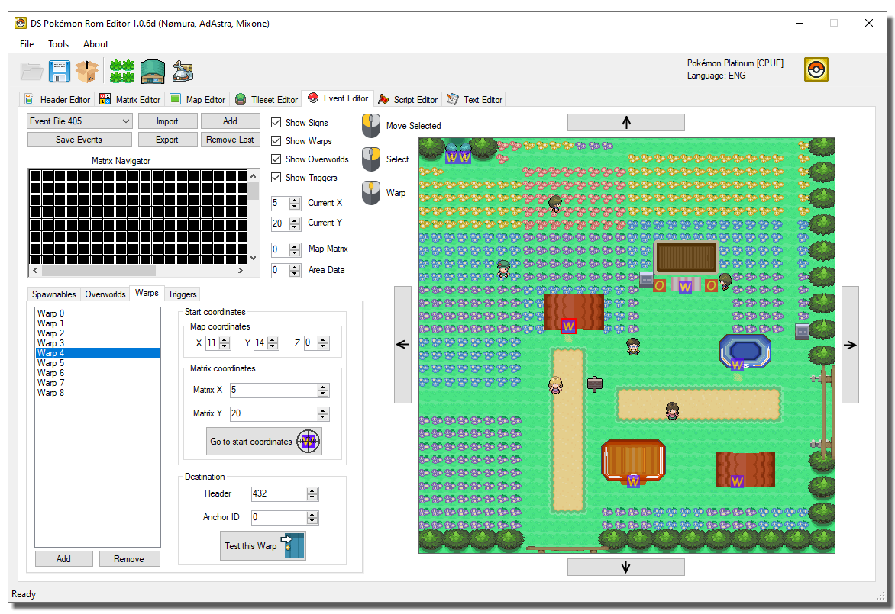

# DS Pokemon Rom Editor

Nomura's C# and WinForm DS Pokemon ROM Editor forked with lots of new features and bugfixes.

## Major Changes to Mixone's fork
- Significantly shorter load and save times.
- Added mouse support and warps navigation feature to the Event Editor.
- Search location feature.
- Editable Internal names.
- Fixed Camera settings selector for HGSS roms.

- Encounter Editor allows adding and removing encounter files.
- Encounter Editor can now attempt to repair corrupted encounter files.

- Fixed "Open Matrix" not loading the correct textures and buildings, especially for interior maps.
- Fixed map screen randomly becoming 3D, even with the collision tab open.
- Fixed OW search algorithm for most (if not all) supported ROMs.
- Added ARM9 memory expander to the new ROM Toolbox.
- Replaced "Search Flag" with "Search any command".

## Minor Changes to Mixone's fork

- New app Icon.
- Fixed app name.
- Fixed many Exceptions, which now show user-friendly messages.
- Fixed error upon loading Dragon's Den header (Music not found).

- Added BDHCAM Support.
- Added placeholder BDHCAM button to ROM toolbox.
- Added placeholder "Pokemon names case converter" button to toolbox.

- Fixed BGS signature of maps being overwritten upon saving.
- Added new ALT key shortcuts (Hold alt to see which shortcuts are available).

- Fixed header flag names.
- Fixed a bug that prevented Internal Names from displaying correctly (String termination).

- Enabled some of the quick script cmd buttons.
- Added New Movement names and changed some of the old ones.
- Expanded collisions database.

- Fixed Matrix editor "add" and "remove" buttons GUI numbering mismatch.
- Fixed wrong numbers when resizing matrices.
- Added a warning when attempting to resize matrix 0.

- Fixed Text search being case sensitive no matter what.
- Fixed "Text Editor" export button.
- Added option to show row numbers as hex in the Text Editor.

- Fixed Encounters editor not opening.
- the "Open Wild Pokémon" button in Header Editor is disabled when a NULL encounter file is detected.
- Encounter Editor detects the selected header.

- Created a palette match algorithm for the Tileset Editor
