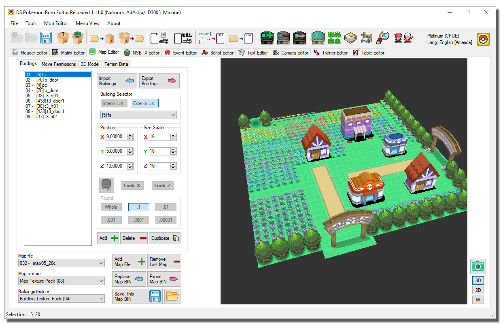
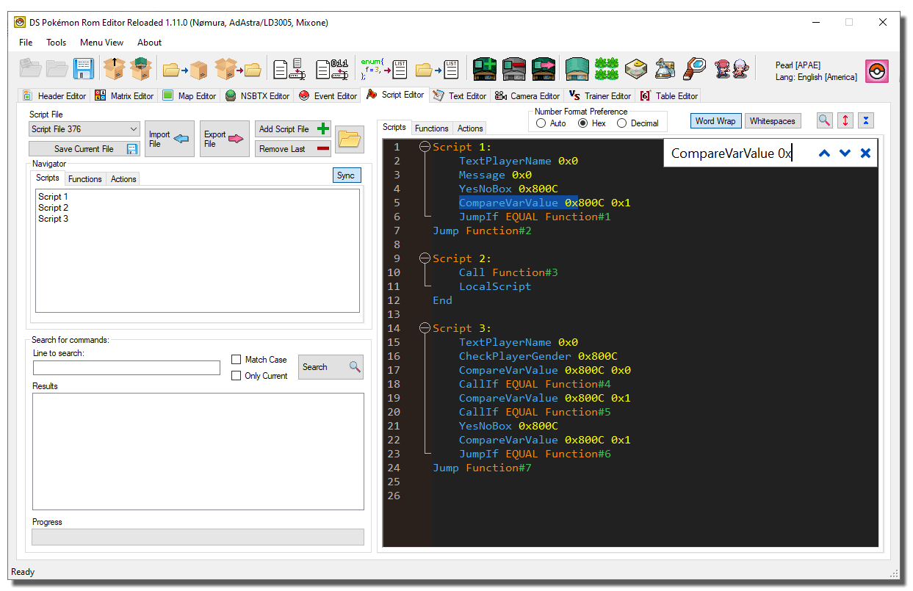
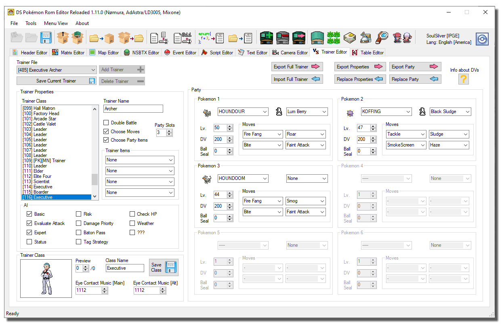

# DS Pokemon Rom Editor

Major overhaul of Nomura's DS Pokemon ROM Editor, with lots of new features and bugfixes.

## Misc changes to the original DSPRE
- Significantly shorter load and save times.
- New, faster Script Editor with syntax highlighting and built-in search features.
- Fixed lots of problems with Japanese DP roms [either not loading or only partially functioning].

- Configurable top bar layouts.
- User Prefs memorization.
- New Advanced Header Search feature.
- New NSBMD and NSBTX utilities.
- NARC Packer/Unpacker utilities.
- List based and Content based Batch Rename utilities.
- Lots of new buttons and icons.
- Color coding of numeric values.
- Read extracted data from a directory, without loading a ROM.
- ARM9 mismatch warning.
- Added new ALT key shortcuts (Hold alt to see which shortcuts are available).
- Fixed Encounter Editor unpacking HG encounters for SS ROMs.
- Fixed Overworld sprite search algorithm for most (if not all) supported ROMs.
- Fixed many Exceptions, which now show user-friendly messages.
- Files used by each editor are easily locatable.
- New ROM Toolbox.

### ROM Toolbox:
Supported patches:
- Expand ARM9 usable memory.
- Dynamic Cameras.
- Set Overlay1 as uncompressed.
- Convert Pokémon names to Sentence Case.
- Standardize item numbers.
- Expand matrix 0.
- Dynamic Headers.
- Disable Texture Animations [HGSS].

### Script Command Database:
A handy window that shows all the available script commands and the parameters they require.
- Many new commands have been identified and added.

### Spawn Settings Editor:
Allows you to change the map where the adventure begins and the initial money.

### Wild Encounters Editor:
- Added wrench button to fix broken encounter files [whenever possible].
- Added missing button functions (add and remove).
- Wild Encounter Editor can now attempt to repair corrupted encounter files.
- Editor now detects the selected header.

### Header Editor:
- Added copy and paste buttons to every header category editor.
- Added import and export buttons to header editor.
- New basic search location feature.
- Updated Header Fields for all games (added WorldMap Coordinates to HGSS header editor).
- Added more HGSS weather effects.
- Redone HGSS weather preview pics.
- Fixed HGSS Camera settings. 
- Fixed header flag names.
- Battle BG and Following Pokemon properties are now fully editable.
- Editable Internal names.
- Added text length label to Internal Names box (Header Editor).
- Fixed a bug that prevented Internal Names from displaying correctly (String termination).
- Fixed "Open Matrix" button not loading the correct textures and buildings, especially for interior maps.

### Matrix Editor:
- Added support for custom color tables.
- Fixed "Add Matrix" and "Remove Matrix" buttons GUI numbering mismatch.
- Fixed wrong row/col indices when resizing matrices.
- Fixed junk input detector.
- The coordinates of the selected map appear in the status bar.
- Matrix names now appear in the selector.

### Map Editor:
- GUI redesign (now with a more straightforward GUI).
- Support for DAE export [Apicula]
- New BGS Section.
- Expanded collisions database.
- Buildings can now be placed and moved with the mouse.
- Fixed buildings wrong scale transform pivot.
- Map models can be exported with embedded textures.
- Sound Plates can be cleared with a button click.
- Added flood fill feature to Permissions tab.
- Added Section size labels to 3D Model, Terrain and BGS Tabs (Map Editor).
- Added support for broken BTX detection to Map Editor and NSBTX Editor.
- Fixed map screen randomly becoming 3D, even with the collision tab open.
- Added BDHCAM Support to the import/export menu.
- Added Map BIN Import button.
- Fixed BGS signature of maps being overwritten upon saving a map.
- Added Export MAP BIN button.
- Fixed type painters resetting after changing map.
- Fixed type painters font size and value [updown] limit.
- Added more type painter colors and collisions.
- New 512x map screenshot button (for PDSMS' background image feature).

### NSBTX Editor:
- GUI Redesign.
- Added missing button functions (add and remove).
- Created a palette match algorithm.

### Event Editor:
- Added mouse support and warps navigation feature.
- The Standardize Items patch is no longer necessary to edit/add Ground Items.
- A blue box now appears under each Warp collision as a visual aid for placing Warp events.
- Events can now be duplicated.
- Events can be selectively imported from another Event file.
- New editable fields (for Spawnables and Triggers).
- Complete rewrite of the Sprite finder.

### Script Editor:
- Replaced "Search Flag" with "Search any command".
- Fixed Text Search and Replace (Results can be double-clicked).
- Replaced Script Macro buttons with a Script Navigator.
- You can now choose the preferred number format.
- Level scripts can be cleared with a button click.
- The Script Editor can identify and report syntax errors.
- Fixed backward address jumps.
- Improved search speed.
- Fixed script export button.

### Text Editor:
- Lines can be moved up and down
- Fixed export button.
- Added option to show row numbers as hex.
- Fixed Text Search and Replace (Results can be double-clicked).
- Improved search speed.
- Added support for Chinese text.

### New Camera Editor:
You can easily change the default camera position in game.

### New Trainer Editor:
Change the Trainer Class, Party, Movesets, AIs and Items of any Trainer in the game.

### New Table Editor:
- Conditional Music Table: allows you to pick a different Header music to play when a specific flag is set. [HGSS only]
- Pre-Battle Effects: you can now associate many different VS. Sequences and Battle tracks to any Trainer Classes or Pokémon.

### New Personal Data Editor:
Edit base stats, Learnable TMs, EVs yield, and more.

### New Learnset Editor:
Edit the moves that a given Pokemon can learn by leveling up.

### New Evolutions Editor:
Edit evolution methods and levels for all Pokemon.