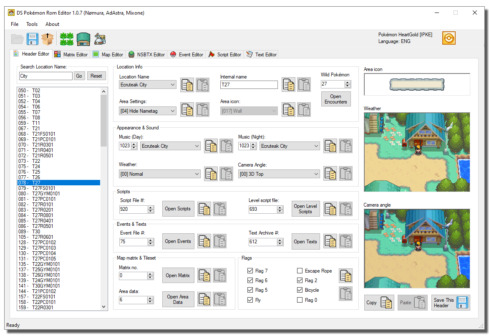
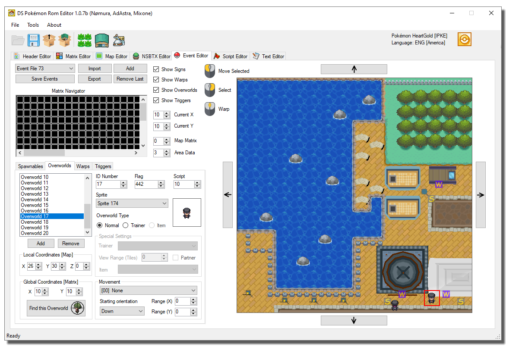

# DS Pokemon Rom Editor

Nomura's C# and WinForm DS Pokemon ROM Editor forked with lots of new features and bugfixes.

## Major Changes to Mixone's fork
- Significantly shorter load and save times.
- Fixed script editor (it's also much faster now).
- Added mouse support and warps navigation feature to the Event Editor.
- Support for custom color tables (matrix editor).

- Added copy and paste buttons to header editor.
- Added import and export buttons to header editor.
- Updated Header Fields for all games (added WorldMap Coordinates to HGSS header editor)
- Added more HGSS weather effects, redone weather preview pics

- Search location feature.
- Added Advanced Header Search feature.

- Fixed Camera settings selector for HGSS roms.
- Fixed Text Search and Replace.

- Wild Encounter Editor allows adding and removing encounter files.
- Wild Encounter Editor can now attempt to repair corrupted encounter files.

- Partially redesigned Building Editor (now with fewer controls and a more straightforward GUI)

- Redesigned NSBTX Editor
- Added NSBTX editor button functions

- Fixed "Open Matrix" not loading the correct textures and buildings, especially for interior maps.
- Fixed map screen randomly becoming 3D, even with the collision tab open.
- Fixed OW search algorithm for most (if not all) supported ROMs.
- Added new patches to the ROM ToolBox (including ARM9 memory expander, BDHCAM and much more).
- Replaced "Search Flag" with "Search any command".

## Minor Changes to Mixone's fork

- Lots of new icons.
- Fixed app name.
- Fixed many Exceptions, which now show user-friendly messages.
- Fixed error upon loading Dragon's Den header (Music not found).
- Some fields will now show a coloured text depending on their value.

- Added BDHCAM Support.

- Fixed BGS signature of maps being overwritten upon saving.
- Added new ALT key shortcuts (Hold alt to see which shortcuts are available).

- Fixed header flag names.
- Editable Internal names.
- Fixed a bug that prevented Internal Names from displaying correctly (String termination).

- Enabled some of the quick script cmd buttons.
- Added New Movement names and changed some of the old ones.
- Expanded collisions database.

- Fixed Matrix editor "add" and "remove" buttons GUI numbering mismatch.
- Fixed wrong numbers when resizing matrices.

- Fixed "Text Editor" export button.
- Added option to show row numbers as hex in the Text Editor.

- Fixed Encounters editor not opening.
- the "Open Wild Pokémon" button in Header Editor is disabled when a NULL encounter file is detected.
- Encounter Editor detects the selected header.

- Created a palette match algorithm for the Tileset Editor
